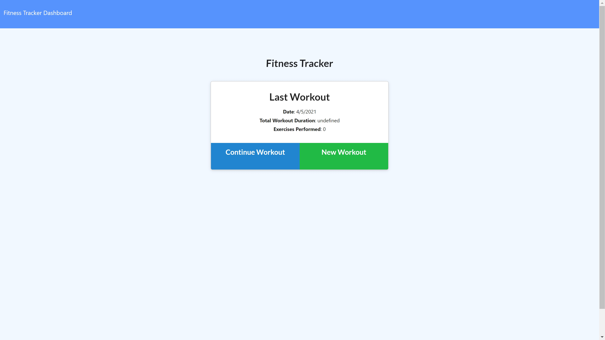

# fitness-tracker

## Description

This application helps users create, edit and track their workouts consistantly. The Pie charts and Graph charts help to provide visual representations of a users logged fitness journey. 
 
--------------------

## User Story

As a user, I want to be able to view create and track daily workouts. I want to be able to log multiple exercises in a workout on a given day. I should also be able to track the name, type, weight, sets, reps, and duration of exercise. If the exercise is a cardio exercise, I should be able to track my distance traveled.

---------------------

## Acceptance Criteria 

-  The user can add excercises to the most recent workout plan.

-  The user can add a new workout plan.

-  The user can view the combined weight of multiple excercises from the past seven workouts on the stats page.

-  The user can view the total duration of each workout from the past seven workouts on the stats page.

------------------------

## Links

-   [Github Repo] (https://github.com/nescalante92/fitness-tracker)

-   [Heroku Deployed Website] (https://calm-cove-45043.herokuapp.com/?id=606b9339e32a5d0015d9aed8)

-------------------------

## Mock Image 

-------------------------